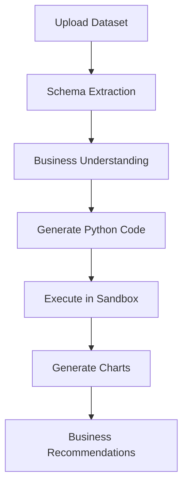
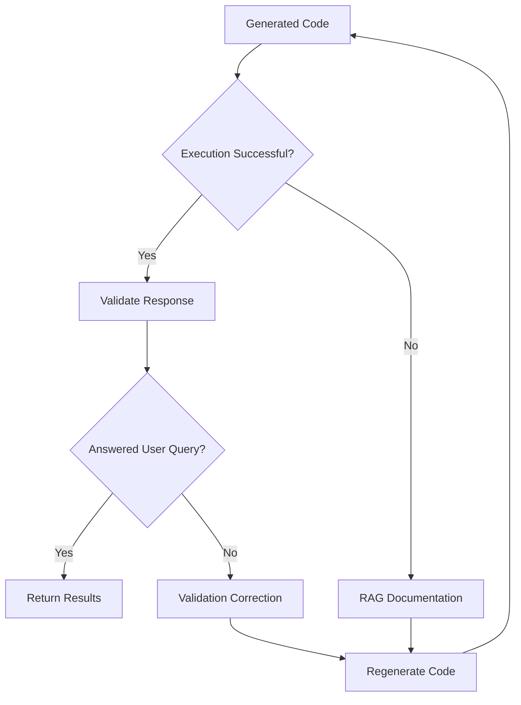

# 🚀 Autonomous Business Analyst Co-Pilot

An AI-powered Business Intelligence platform that transforms raw datasets into actionable insights using **Natural Language, LLMs, Secure Code Execution, and Retrieval-Augmented Generation (RAG)**.

Users simply upload a dataset, ask questions in plain English, and the AI automatically generates Python code, executes it securely, creates visualizations, and provides business recommendations.

---
## 🎥 Project Demo

Watch the complete end-to-end demonstration of the **Autonomous Business Analyst Co-Pilot** here:

👉 **https://youtu.be/MN5ZRL666sk**


# ✨ Key Features

- 🤖 Autonomous AI-powered data analysis
- 📊 Automatic data profiling & quality assessment
- 📈 Business KPI and executive insight generation
- 🔄 Self-healing code generation using RAG
- 🛡️ Secure Python sandbox execution
- 📉 Interactive Plotly visualizations
- 🧠 Dynamic schema detection (no fixed column names)
- 📄 Executive PDF & Markdown report export
- 💬 Multi-turn conversational analysis
- 📂 Supports CSV, Excel, JSON, TSV, Parquet, SQLite & ZIP

---

# 🏗️ System Architecture


---

# ⚙️ Analysis Pipeline



---

# 🔄 Self-Healing Workflow



---

# 📊 Core Capabilities

### Data Profiling

Automatically computes:

- Dataset Health Score
- Missing Values
- Duplicate Detection
- Summary Statistics
- Correlations
- Outliers
- Skewness & Kurtosis

---

### Business Intelligence

Generates:

- Executive Summary
- Revenue Drivers
- Profitability Analysis
- Customer Behavior
- Operational Risks
- Strategic Recommendations

---

### Machine Learning

Built-in analytics include:

- Customer Segmentation (KMeans)
- Time Series Forecasting
- Trend Analysis
- Correlation Analysis

---

### Dynamic Dataset Understanding

The AI never assumes column names.

Before generating code it automatically:

- Reads dataset schema
- Detects data types
- Maps business concepts using synonym matching
- Generates dataset-specific Python code

This allows the same agent to analyze completely different datasets without retraining.

---

# 🛡️ Secure Sandbox

All generated Python code executes inside a restricted sandbox featuring:

- Workspace isolation
- File system protection
- Network blocking
- Restricted subprocess execution
- Path traversal prevention
- Safe native library loading

---

# 📚 Retrieval-Augmented Generation (RAG)

When execution fails:

1. Error is analyzed
2. Relevant official documentation is retrieved from ChromaDB
3. Corrected Python code is generated
4. Analysis automatically retries

Knowledge base includes:

- Python
- Pandas
- NumPy
- Plotly
- Scikit-learn
- StatsModels

---

# 🖥️ Application Modules

| Module | Purpose |
|---------|---------|
| 📊 Data Profiling | Dataset quality, KPIs & statistics |
| ⚠️ Outliers | Anomaly & outlier detection |
| 📈 Dashboard | Interactive charts & forecasting |
| 📥 Reports | PDF, Markdown & CSV export |

---

# 💬 Example Queries

- Generate an executive sales dashboard.
- Analyze regional performance.
- Forecast sales for the next three months.
- Perform customer segmentation.
- Detect anomalies.
- Explain revenue drivers.
- Build a regression model.
- Generate an executive business report.

---

# 🛠️ Technology Stack

| Layer | Technologies |
|--------|--------------|
| Frontend | Streamlit |
| LLM | Gemini 2.5 Flash, Flash Lite, Pro |
| Framework | LangChain |
| Data | Pandas, NumPy, SciPy |
| ML | Scikit-learn, StatsModels |
| Visualization | Plotly, Matplotlib, Seaborn |
| RAG | ChromaDB, Sentence Transformers |
| Reports | FPDF2 |

---

# 📂 Project Structure

```text
.
├── app.py
├── agent.py
├── business_analyst.py
├── sandbox.py
├── rag.py
├── prompts.py
├── requirements.txt
├── workspace/
├── storage/
└── README.md
```

---

# 🚀 Installation

```bash
git clone <repository-url>

cd Autonomous-Business-Analyst-CoPilot

pip install -r requirements.txt

streamlit run app.py
```

---

# 🔑 API Key

The application uses **user-provided Gemini API keys**.

Simply:

1. Launch the application
2. Select a Gemini model
3. Paste your API key in the sidebar
4. Start analyzing data

No `.env` configuration is required.

---

# ✅ Assignment Deliverables

- ✔ Streamlit Web Application
- ✔ Autonomous AI Agent
- ✔ Secure Sandbox
- ✔ RAG over Official Documentation
- ✔ Automatic Code Generation
- ✔ Interactive Visualizations
- ✔ Business Intelligence Engine
- ✔ Multi-format Dataset Support
- ✔ GitHub Documentation
- ✔ End-to-End AI Workflows

---

# 👨‍💻 Developer

**Tanishk Sharma**

B.Tech CSE (AI & ML)

JECRC University
