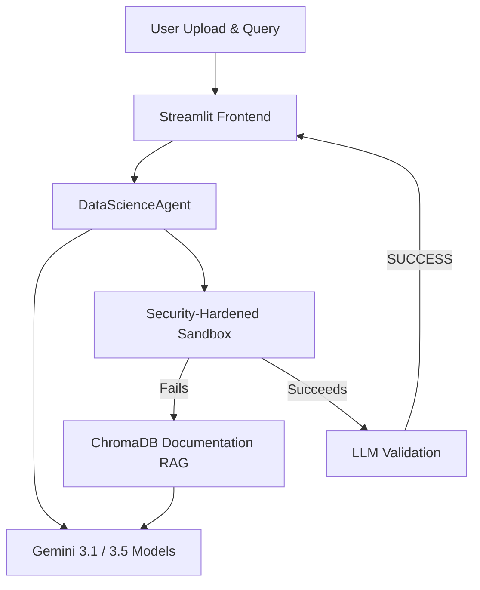

# Autonomous Data Science Co-Pilot

The Autonomous Data Science Co-Pilot is an advanced, AI-powered agentic system that allows business users to perform complete, end-to-end data analysis on raw datasets using natural language. No coding is required.

## Features
- **Zero-Retraining Architecture**: Dynamically adapts to any new dataset (CSV, Excel, JSON, Parquet, SQLite, TSV, ZIP).
- **Rich Data Profiling**: Automatically infers memory footprint, identifies missing/duplicate rows, parses variable distributions, and builds summary statistics.
- **Autonomous Execution**: Generates production-ready Python/Pandas code and runs it in an isolated, security-hardened local sandbox.
- **Self-Healing Loop via RAG**: When an error occurs, the agent retrieves official Pandas/Plotly documentation from a local ChromaDB instance to fix its own code and retries execution.
- **Interactive Visualizations**: Generates rich Plotly HTML visualizations, allowing users to zoom, pan, and hover over their insights.
- **Persistent Conversational Memory**: Supports multi-step operations on the same project (e.g., "Clean the data" -> "Now build a regression model").
- **KMeans Cohort Segmentation**: Built-in 2D/3D clustering and analysis for segmenting numerical datasets.
- **Time-Series Forecasting**: Automated 3-month moving average and linear regression forecasting with Plotly trends.
- **User-Level Isolation**: Separate workspaces per User ID, preventing data leakage in multi-tenant environments.

## Architecture


## Security Hardening
The execution sandbox implements runtime guardrails at the Python level inside the subprocess environment:
- **Subprocess Spawning & Reloading**: Disabled subprocess spawning (including multiprocessing and fork) and module reloading to prevent sandbox escape vectors.
- **Network Connections**: Blocked outbound socket/network connections (including urllib, requests, and ctypes) to prevent unauthorized data exfiltration.
- **File System Protection**: Restricts file write operations, mutations (such as remove, rename, rmdir, and shutil actions), and low-level descriptor opens strictly to the project's workspace folder, preventing tampering with the host filesystem.
- **Path Traversal Shield**: All input parameters (user ID, project name) are whitelisted to `[A-Za-z0-9_-]+` and verified using absolute path resolution prefixes.

> [!WARNING]
> These mechanisms represent runtime guardrails at the Python level. For running untrusted or adversarial inputs (e.g. prompt injection via uploaded file content) in a production environment, OS-level isolation (such as Docker, gVisor, or nsjail) is still required.

## Installation & Setup
1. Clone this repository and ensure Python 3.10+ is installed.
2. Install the required packages:
   ```bash
   pip install -r requirements.txt
   ```
3. Set up your Gemini API Key by renaming `.env.example` to `.env` and setting your key:
   ```env
   GEMINI_API_KEY=your_key_here
   ```
   *Note: If `GEMINI_API_KEY` is defined in `.env`, the sidebar input will default to this key automatically.*

## Running the Application
Launch the Streamlit app:
```bash
streamlit run app.py
```
This will open the web UI in your browser. From there, you can enter/change User IDs, create workspaces, upload data, and perform interactive analysis.
